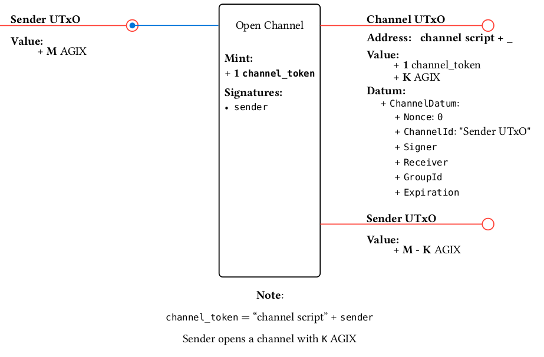
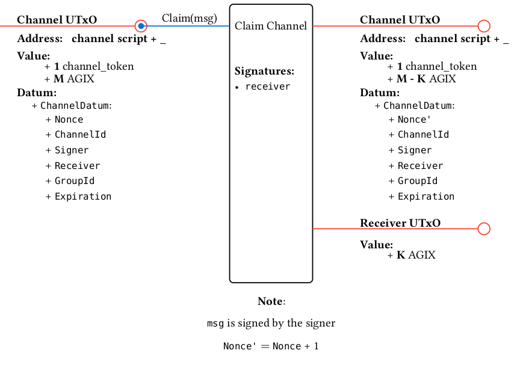
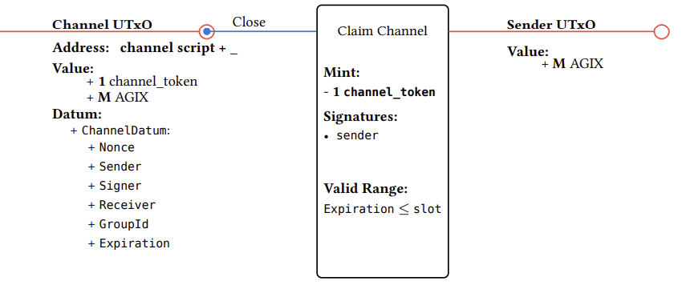

# MulitParty Escrow Design

## Overview
A **channel** represents a “payment relationship” between a sender and a service-provider. There can be many channels between the two. The only token involved is always `AGIX`.
Each channel linking a client to a service provider is represented by a UTxO containing a `channel token`, which is minted upon every channel creation. This UTxO's datum stores information specific to the channel.
When a channel closes, the `channel token` is burned.
Every transaction interacting with the script will be transparently identified by the action that takes place there.

### Channel UTxO

#### Datum
- ChannelId, represented by some UTxO-Ref from the inputs of the sender
- Nonce, used to distinguish claim transactions
- Signer Public Key
- Receiver PubkeyHash
- GroupId
- Expiration Date

#### Value
- Channel Token
- min-ADA
- AGIX balance on the channel

### Transactions

#### Open
In this transaction, a user creates and deposits AGIX on a payemnt channel. The channel Token is then minted, which is the concatenation of the channel script addres with the sender's public key hash.

#### Update: Extend and/or Add funds
Users can add funds to any non-expired channel, but only the sender can extend its expiration date. The new expiration date must be later than the current one.

#### Claim
Service providers can claim their funds providing the corresponding signed message.

#### Close
A channel can be closed either by the service provider after making a claim or automatically when it expires. In both cases, the sender can reclaim the remaining AGIX in the channel, effectively withdrawing the funds.

### Validator Scripts