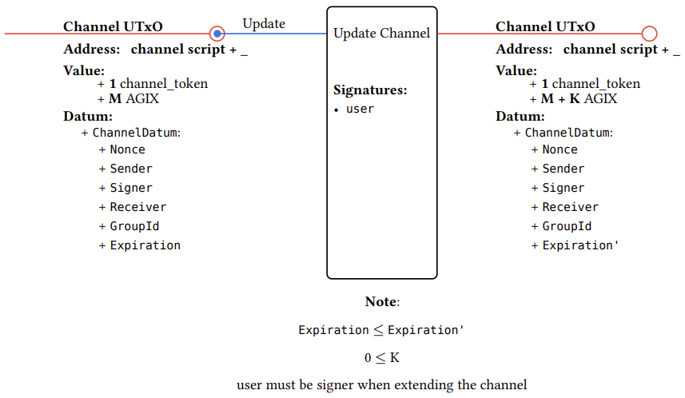
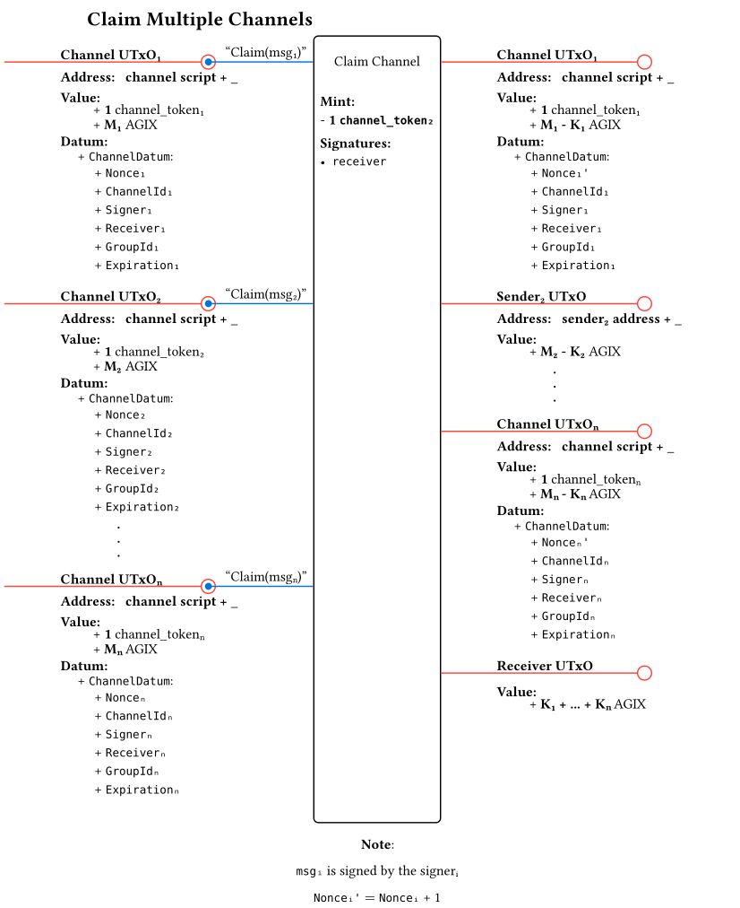

# MultiParty Escrow Design

## Overview
A **channel** represents a “payment relationship” between a sender and a service-provider. There can be many channels between the two. The only token involved is always `AGIX`.
Each channel linking a client to a service provider is represented by a UTxO containing a `channel token`, which is minted upon every channel creation. This `channel token` has a fixed minting policy and its name is the sender's public key hash. The UTxO's datum stores information specific to the channel.
When a channel closes, the `channel token` is burned.
Every transaction interacting with the script will be transparently identified by the action that takes place there.

### Channel UTxO

#### Address
- payment part: [channel script](#validator-script)
- staking part: _

#### Datum
- ChannelId **--txHash+outputIndex of some UTxO reference from an inputs of the open transaction--**
- Nonce **--used to give uniqueness to each signature on claim transactions--**
- Signer Public Key **--used to verify the signatures on claim transactions--**
- Receiver PubkeyHash **--used to verify receiving address--**
- GroupId
- Expiration Date **--used to verify valid ttl of the channel--**

#### Value
- Channel Token
- min-ADA
- AGIX balance on the channel

### Transactions

#### Open
In this transaction, a user creates and deposits AGIX on a payemnt channel. The channel Token is then minted which, as mentioned, is fixed.

#### Update: Extend and/or Add funds
Users can add funds to any non-expired channel, but only the sender can extend its expiration date. The new expiration date must be later than the current one.

#### Claim
Service providers can claim their funds providing the corresponding signed message.

Multiple channels could be claimed in the same transaction. Some of them could be also closed in that tx.

#### Close
A channel can be closed either by the service provider after making a claim or automatically when it expires. After a channel has closed, the sender can reclaim the remaining AGIX in the channel, withdrawing the funds to their wallets.

### Validator
Multivalidator with a minting policy, a spend validator and a withdraw validator.

All channels share the same address, so there is no parameter for the validator.

<u>_Notation_</u>: In datum validations, we'll use *any* to indicate that no validation will be performed on that field, besides the type check. For example:
 * group_id: any ByteArray

#### <u>_Minting policy_</u>
##### Mint
* Minting checks:
    * Mints 1 token of this policy, with the sender's public key hash as its token name.
    * Check length of token name is 28 bytes long

* Output checks:
    * Enforce channel to be the first output
    * Address:
        * Check output has self script address
        * Stake credential = None
    * Value:
        * Has only Lovelace, the minted control token, and an amount ≥ 0 of AGIX.

    * Datum:
        * ChannelId = txHash + outputIndex of the first input
        * Nonce = 0
        * Expiration date > validity range upper bound
        * Check Receiver field is 28 bytes long
        * Check Signer field is 32 bytes long
        * Group Id: any ByteArray
    * Reference script = None

##### Burn
* Minting checks:
    * Either:
        * Check there is a script input with a "Close" redeemer and the amount burned is exactly -1
        * Check a Withdraw validator is running.

#### <u>_Spend validator_</u>
##### Update
* Minting checks:
    * No tokens with this policy are minted nor burned

* Transaction checks:
    * Only one script input of self address
    * Check channel is still valid (expiration date > validity range upper bound)
    * Sender signing the tx IF the expiration date is updated

* Output checks:
    * Enforce channel to be the first output
    * Address:
        * Output preserves script address
    * Value:
        * without_lovelace(Output value) = without_lovelace(Input value) + K AGIX, where K >= 0
    * Datum:
        * output Expiration date >= input Expiration date
        * rest of the datum remains unchanged
    * Reference script = None

##### Claim
* Transaction checks:
    * Signed by the receiver

* Check Withdraw validator is running

##### Close
* Minting checks:
    * Burns exactly -1 token of self policy.

* Transaction checks:
    * Only one script input of self address.
    * Signer by the sender

* Input Checks:
  * Datum:
      * expiration date > validity range upper bound

#### <u>_Withdraw validator_</u>
Only used for claim transactions.

The way to validate this is by mapping each input to its corresponding output, that is, the output at index 1 corresponds to the input at index 1, the output at index 2 to the input at index 2, and so on.

For each script input:
* If the redeemer for this input indicates to Close the channel, validate:
    * corresponding output address = sender address
    * corresponding output value = Input value - claimed amount - channel token
    * channel token is burned
* If the redeemer indicates not to Close the channel, validate over the corresponding output:
    * Address = input address
    * Value = input value - claimed amount
    * Datum:
        * Output nonce = input nonce + 1
        * Rest of the datum remains unchanged
    * Reference script = None
* Verify signature in the redeemer